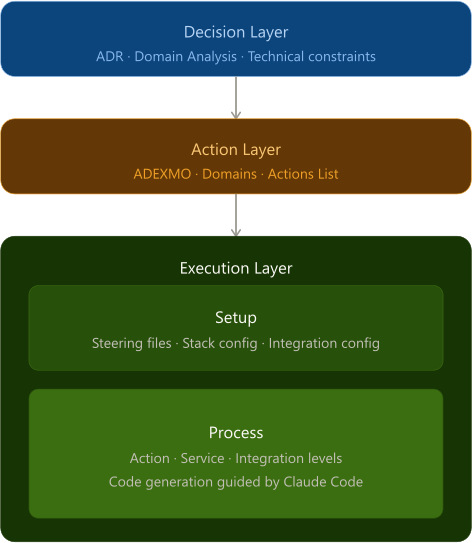

# Action-Based Development (ABD)

ABD is a structured method for developing software with LLM agents. It defines how architectural decisions, system contracts, and implementation rules are organized so that an LLM agent can generate consistent, traceable, and verifiable code.

ABD does not replace traditional software analysis. Macro analysis, micro analysis, use cases, and domain modeling remain the starting point of any serious project and must be completed before ABD begins. ABD is the bridge between that analysis and the code: the mechanism that transforms ratified decisions into a structured context that an LLM agent can execute without ambiguity or contradiction.

ABD is the operational extension of [ADEXMO](https://github.com/myobject-eu/adexmo): it defines the guidelines for applying the ADEXMO pattern with LLM agents in a structured, layered, and traceable way.

For a quick overview of the method, see [ABD in One Page](docs/abd-in-one-page.md).

---

## The core idea

Without a structured method, neither the human nor the LLM can reliably reduce noise and contradictions in a software project. The human loses the thread on complex projects. The LLM starts contradicting itself across sessions because it has no explicit contract to refer back to.

ABD solves both problems with the same mechanism: the explicit artifacts of each layer constrain the next one.

```
Decision Layer  →  reduces ambiguity of intent
Action Layer    →  reduces ambiguity of contract
Execution Layer →  reduces ambiguity of implementation
```

Each layer inherits the clarity of the previous one. Every step eliminates a class of errors before they propagate downward. The human stays in the loop at every layer, but progressively shifts from implementation decisions to strategic ones.

---

## How it works

[](docs/assets/abd_layers_schema.png)

### Decision Layer

The Decision Layer is where architectural decisions are made and ratified. It is not an analysis tool. Traditional analysis -- macro analysis, micro analysis, use cases, domain modeling -- must be completed before the Decision Layer starts. The Decision Layer translates the conclusions of that analysis into explicit, traceable architectural decisions.

An architectural decision is any choice that constrains the design or implementation of the system: stack, security model, data model conventions, API style, dependency management.

Each decision is captured in an Architecture Decision Record (ADR): a structured document that declares context, problem, decision, alternatives considered, consequences, and risks with their mitigations. ADRs are produced through a guided conversation between the human and the LLM: the LLM proposes options with their trade-offs and drafts the ADR, the human reviews and ratifies it. An ADR moves from Proposed to Approved upon ratification, and to Superseded if a later ADR revises or reverses it. Only Approved ADRs are authoritative.

ADRs are committed to the development project repository, under `abd/decisions/`. They are the memory of the project: every decision that constrains the Action Layer and the Execution Layer is traceable back to the ADR that ratified it. The language in which ADRs are written is a team convention: each team writes them in the language that works best for its members.

The Decision Layer ends when all relevant architectural choices have been ratified and the Exit Checklist is satisfied. No development work starts before this layer is complete.

### Action Layer

The Action Layer translates ratified decisions into an executable system contract. Following the ADEXMO pattern, the system is decomposed into Actions: atomic, single-responsibility units of business logic. Each Action has a defined domain, a signature, and a clear description of what it does and what it does not do.

The output of the Action Layer is the Actions List: the complete inventory of Actions that constitutes the functional contract of the system. The Actions List is validated by the human before the Execution Layer starts.

### Execution Layer

The Execution Layer is where the coding agent generates the project code. It has two moments.

During **Execution Layer Setup**, the human and the coding agent produce the Steering Files: a set of structured Markdown documents that together constitute the complete operational context for code generation. Stack, integrations, database schema, API contracts, security model, UI specifications, and Action dependencies are all declared explicitly before a single line of code is written.

During **Execution Layer Process**, the coding agent reads the Steering Files through `AGENTS.md` and develops the Actions one by one, following the dependency order declared in `action-dependencies.md`. Each Action is developed, tested, and validated before the next one starts.

---

## Tasselli

ABD breaks down the three layers into a sequence of **Tasselli**: completeness conditions, each with explicit approval requirements, that must be reached in order before the corresponding phase is considered concluded.

A Tassello is not satisfied merely because its artifact exists. It is satisfied when the artifact is mature enough to support the next phase without transmitting gaps or ambiguities. The LLM evaluates both presence and maturity, and signals when a Tassello is not yet in place, when a phase is being closed too quickly, or when a decision is being iterated without converging toward ratification.

The complete sequence, with codes, artifacts, references, types, and approval requirements, is defined in [ABD Tasselli](docs/abd-tasselli.md). Project-level progress against this sequence is tracked in `abd/tasselli-status.md`, a versioned file in the project repository that records, for each Tassello, its status, the date it was fixed, and any relevant notes.

Marking a Tassello as Fixed requires the corresponding artifact, where one is specified, to exist in the project repository and to be ratified by the human. Updating `tasselli-status.md` without the corresponding artifact misrepresents the state of the project.

---

## Repository structure

```
abd/
├── docs/
│   ├── abd-in-one-page.md          Quick overview of the method
│   ├── abd-tasselli.md             Full Tasselli sequence across all layers, with approval requirements
│   ├── working-with-llm-agents.md  Why artifacts are agent-generated and human-validated
│   ├── decision-layer/             ADR index and process documentation
│   │   ├── README.md
│   │   ├── domain-analysis.md      Domain Analysis ADR guidance (Tassello 1.12)
│   │   ├── technical-constraints.md  Technical Constraints ADR guidance (Tassello 1.13)
│   │   ├── adr-process.md          Architectural ADR process (Tassello 1.14)
│   │   ├── exit-checklist.md       Exit Checklist gate before the Action Layer (Tassello 1.15)
│   │   └── adr-ratification.md     ADR structure, states, ratification, and gap management (Tassello 1.16)
│   ├── action-layer/                Actions List process documentation
│   │   ├── README.md
│   │   └── domain-validation.md    Domain candidate validation criteria (Tassello 2.01)
│   └── execution-layer/             Steering File definitions and table
│       ├── README.md
│       ├── steering-files-table.md
│       ├── actions-list-definition.md
│       ├── stack-config-definition.md
│       ├── integration-config-definition.md
│       ├── database-schema-definition.md
│       ├── transport-contract-definition.md
│       ├── binding-contract-definition.md
│       ├── security-model-definition.md
│       ├── ui-spec-definition.md
│       ├── action-dependencies-definition.md
│       ├── action-implementation.md
│       └── AGENTS-definition.md
└── presets/
    ├── README.md                   Presets overview, naming convention, and priorities
    ├── security-model/             Precompiled security configurations by stack
    ├── ui-spec/                    Precompiled UI specifications by framework
    ├── stack-config/               Precompiled stack configurations
    └── database-schema/            Starter kit with foundational entities
```

---

## Presets

For the most common stack combinations, ABD provides Presets: precompiled Steering Files derived from real projects, ready to use as a starting point. Presets are available for `security-model.md`, `ui-spec.md`, `stack-config.md`, and `database-schema.md`.

A Preset is not a final file. It must be reviewed and customized with project-specific details before use. It eliminates the overhead of starting from scratch and reduces the risk of incomplete configurations in critical areas like security.

See [Presets](https://github.com/myobject-eu/abd/blob/main/presets/README.md) for documentation and available configurations.

---

## Where to start

If you are new to ABD, read the layer documentation in order:

1. `docs/decision-layer/` -- how decisions are made and ratified
2. `docs/action-layer/` -- how the system contract is built with ADEXMO
3. `docs/execution-layer/README.md` -- how Steering Files are produced and used

If you are setting up the Execution Layer for a project, start from `docs/execution-layer/steering-files-table.md`.

---

## Relationship with ADEXMO

ADEXMO defines the Action pattern: atomic, single-responsibility units of business logic with typed inputs and outputs, independent of framework and transport layer. ABD adopts ADEXMO as the foundation of the Action Layer and extends it with the Decision Layer and the Execution Layer.

Without ABD, ADEXMO is a coding pattern. With ABD, it becomes a full development pipeline where every Action is derived from ratified decisions, every dependency is declared explicitly, and the coding agent has the context it needs to generate consistent code from the first session to the last.

---

## ABD as a human+LLM orchestration method

ABD is not a documentation methodology. It is a human+LLM orchestration methodology where artifacts are generated by the coding agent and validated by the human — not written manually.

This distinction is the single most important thing to understand before adopting ABD. Without it, the method appears heavy. With it, the overhead becomes negligible and the structure becomes an asset.

See [Working with LLM Agents](docs/working-with-llm-agents.md) for a detailed explanation of this model, including the problems ABD is designed to solve and how the human+agent roles are distributed across the three layers.

---

## Key principles

- Every decision is ratified before any code is written
- Every layer produces explicit, verifiable artifacts that constrain the next layer
- The coding agent never infers what has been declared: if it is in a Steering File, it is law
- The human validates every artifact at every layer boundary
- Ambiguity is eliminated progressively, not patched after the fact
